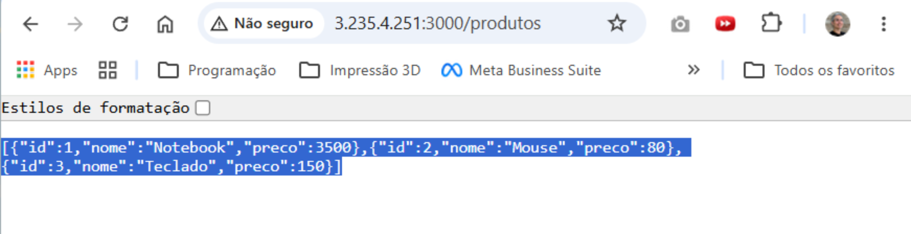
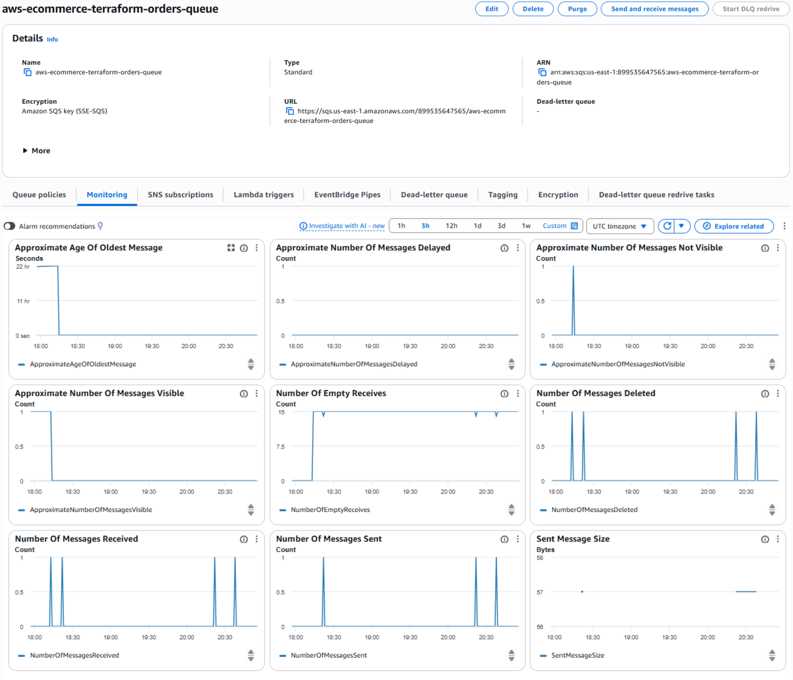
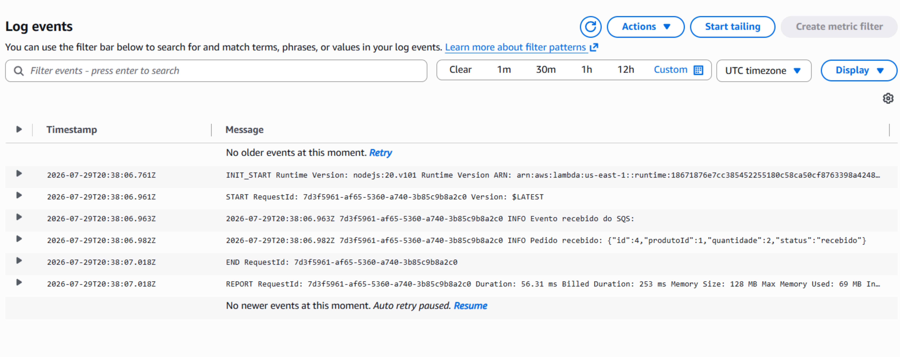
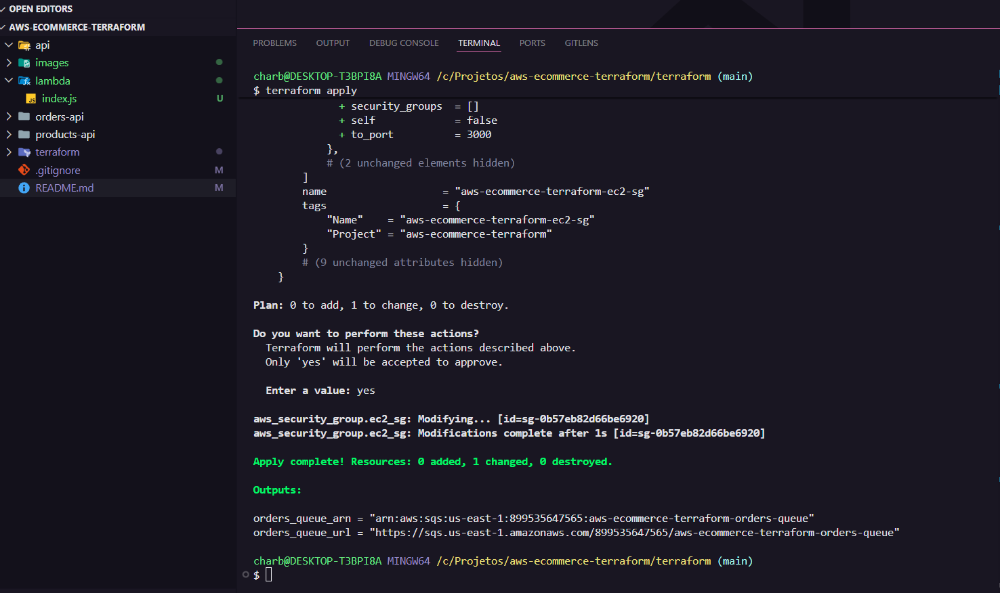

# AWS E-commerce com Terraform

Projeto de infraestrutura e microsserviços desenvolvido como atividade do Capacita iRede, utilizando AWS, Terraform e Node.js.

O objetivo do projeto é provisionar uma infraestrutura completa na AWS utilizando Infraestrutura como Código (IaC), suportando duas APIs e um fluxo de mensageria assíncrona.

## Arquitetura

O fluxo principal da aplicação é:

```text
Usuário
   |
   v
EC2
   |
   v
API de Pedidos
   |
   v
Amazon SQS
   |
   v
AWS Lambda
   |
   v
CloudWatch Logs
```

A instância EC2 também executa a API de Produtos.

## Tecnologias utilizadas

- AWS
- Terraform
- Amazon VPC
- Amazon EC2
- Amazon SQS
- AWS Lambda
- Amazon CloudWatch
- AWS IAM
- Node.js
- Express
- AWS SDK for JavaScript
- Git
- GitHub

## Infraestrutura AWS

Toda a infraestrutura é provisionada utilizando Terraform.

### Rede

- VPC
- Subnet pública
- Internet Gateway
- Route Table
- Associação da Route Table à Subnet

### Segurança

- Security Group
- Porta 22 para SSH
- Porta 80 para HTTP
- Porta 3000 para API de Produtos
- Porta 3001 para API de Pedidos

### Compute

Uma instância Amazon EC2 é utilizada para executar as duas APIs Node.js.

### Mensageria

A fila Amazon SQS recebe os pedidos enviados pela API de Pedidos.

### Serverless

Uma função AWS Lambda é acionada automaticamente quando uma nova mensagem chega à fila SQS.

A Lambda processa a mensagem e registra o pedido no Amazon CloudWatch Logs.

### IAM

A infraestrutura utiliza IAM Roles para permitir:

- EC2 enviar mensagens para o Amazon SQS.
- Lambda consumir mensagens do SQS.
- Lambda registrar logs no CloudWatch.

## Estrutura do projeto

```text
aws-ecommerce-terraform/
│
├── lambda/
│   └── index.js
│
├── products-api/
│   ├── index.js
│   ├── package.json
│   └── package-lock.json
│
├── orders-api/
│   ├── index.js
│   ├── package.json
│   └── package-lock.json
│
├── terraform/
│   ├── vpc.tf
│   ├── security.tf
│   ├── ec2.tf
│   ├── sqs.tf
│   ├── lambda.tf
│   ├── iam.tf
│   ├── provider.tf
│   ├── variables.tf
│   ├── terraform.tfvars
│   └── outputs.tf
│
├── images/
├── .gitignore
└── README.md
```

## API de Produtos

API REST desenvolvida com Node.js e Express.

Endpoint principal:

```text
GET /produtos
```

Exemplo de resposta:

```json
[
  {
    "id": 1,
    "nome": "Notebook",
    "preco": 3500
  },
  {
    "id": 2,
    "nome": "Mouse",
    "preco": 80
  },
  {
    "id": 3,
    "nome": "Teclado",
    "preco": 150
  }
]
```

## API de Pedidos

A API de Pedidos recebe um pedido e envia uma mensagem para o Amazon SQS utilizando o AWS SDK for JavaScript.

Endpoint:

```text
POST /pedidos
```

Exemplo:

```json
{
  "produtoId": 1,
  "quantidade": 2
}
```

Fluxo:

```text
POST /pedidos
      |
      v
API na EC2
      |
      v
Amazon SQS
      |
      v
AWS Lambda
      |
      v
CloudWatch Logs
```

## Como executar o Terraform

Entre na pasta:

```bash
cd terraform
```

Inicialize o Terraform:

```bash
terraform init
```

Formate os arquivos:

```bash
terraform fmt
```

Valide a configuração:

```bash
terraform validate
```

Visualize o plano:

```bash
terraform plan
```

Crie a infraestrutura:

```bash
terraform apply
```

Confirme digitando:

```text
yes
```

## Como acessar a aplicação na EC2

Após o provisionamento, utilize o endereço IPv4 público da instância EC2.

API de Produtos:

```text
http://IP_PUBLICO_EC2:3000/produtos
```

A API de Pedidos utiliza:

```text
http://IP_PUBLICO_EC2:3001/pedidos
```

> O endereço IPv4 público pode mudar caso a instância seja recriada. Consulte o Console AWS ou os outputs do Terraform para obter o endereço atual.

## Como testar a API de Produtos

No navegador ou utilizando curl:

```bash
curl http://IP_PUBLICO_EC2:3000/produtos
```

## Como testar o fluxo de pedidos

Execute:

```bash
curl -X POST http://IP_PUBLICO_EC2:3001/pedidos \
-H "Content-Type: application/json" \
-d '{"produtoId":1,"quantidade":2}'
```

Resposta esperada:

```json
{
  "message": "Pedido criado e enviado para a fila SQS!",
  "pedido": {
    "id": 4,
    "produtoId": 1,
    "quantidade": 2,
    "status": "recebido"
  }
}
```

Após o envio:

1. A API recebe o pedido na EC2.
2. O pedido é enviado para o Amazon SQS.
3. O SQS aciona a AWS Lambda.
4. A Lambda processa a mensagem.
5. O processamento é registrado no CloudWatch Logs.

## Evidências

### 1. EC2 com aplicação rodando

A API de Produtos foi executada na instância EC2 e acessada externamente através do IPv4 público na porta 3000.



### 2. Mensagens no Amazon SQS

O monitoramento da fila demonstra o envio, recebimento e consumo das mensagens pela aplicação.



### 3. Lambda processando mensagens do SQS

A função AWS Lambda é acionada pelo Amazon SQS. Os logs no CloudWatch comprovam o recebimento e processamento do pedido.



### 4. Provisionamento com Terraform

A infraestrutura foi atualizada com sucesso utilizando `terraform apply`, sem destruição de recursos.



## Validação da infraestrutura

Após o provisionamento e os testes:

```bash
terraform validate
```

Resultado esperado:

```text
Success! The configuration is valid.
```

E:

```bash
terraform plan
```

Resultado esperado quando não existem alterações pendentes:

```text
No changes. Your infrastructure matches the configuration.
```

## Encerramento

Após finalizar a avaliação do projeto e quando a infraestrutura não for mais necessária:

```bash
terraform destroy
```

Confirme digitando:

```text
yes
```

Esse comando remove os recursos provisionados pelo Terraform e evita manter recursos desnecessários ativos na AWS.

## Objetivo alcançado

O projeto demonstra na prática:

- Cloud Computing
- Infraestrutura como Código (IaC)
- Terraform
- APIs REST
- Microsserviços
- Mensageria assíncrona
- Amazon SQS
- AWS Lambda
- Amazon CloudWatch
- AWS IAM
- Amazon EC2
- Provisionamento automatizado na AWS
- Versionamento com Git e GitHub

## Material de estudo

Além da documentação técnica do projeto, foi criada uma apostila completa de estudo baseada na implementação realizada durante o Projeto Avançado.

O material aborda:

- Arquitetura da solução
- Terraform e Infraestrutura como Código (IaC)
- Amazon VPC e Security Groups
- Amazon EC2
- AWS IAM
- Amazon SQS
- AWS Lambda
- Amazon CloudWatch
- APIs com Node.js
- Git e GitHub
- Troubleshooting
- Segurança e boas práticas
- Custos AWS
- Encerramento seguro dos recursos com Terraform

A apostila também contém perguntas de revisão, simulado, glossário, comandos importantes e um desafio para reconstruir o projeto.

📄 [Acessar a apostila completa](docs/apostila-projeto-avancado.pdf)